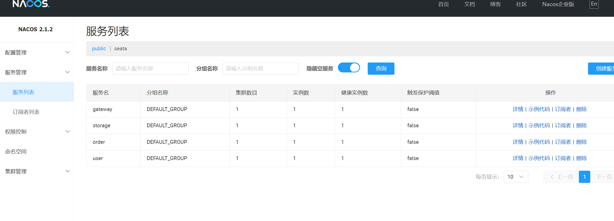
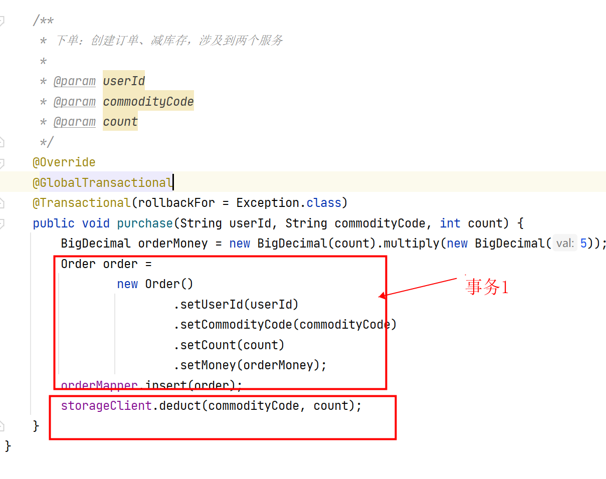

## 微服务架构提供的能力及需要解决的问题

- 服务注册与发现
- 服务限流与降级
- 服务间通信调用
- 分布式配置管理
- 分布式事务
- 消息驱动能力

## 技术选型

| 类型           | 组件                                                         |
| -------------- | ------------------------------------------------------------ |
| 服务注册与发现 | Nacos                                                        |
| 服务熔断限流   | Sentinel(**[resilience4j](https://github.com/resilience4j/resilience4j)**) |
| 服务间通信调用 | Open Feign                                                   |
| 配置中心       | Nacos                                                        |
| 服务网关       | Spring Cloud Gateway                                         |
| 分布式事务     | Seata                                                        |
| 消息队列       | RocketMQ                                                     |
| 调用链路监控*  | skywalking                                                   |
| 监控*          | Prometheus + Grafana(**[micrometer](https://github.com/micrometer-metrics/micrometer)**) |

## 主要组件

- Nacos

  动态服务发现、配置管理和服务管理平台，提供**注册中心**和**配置中心**的能力。同类型的有Eureka(AP)、Consul(CP)，Nacos(AP、CP)。

- Sentinel

  流量控制、熔断降级、系统负载多个维度保障服务的稳定性。同类型的有Hystrix。

- Open Feign

  Feign 是一个声明式的 REST 客户端，Feign 提供了 HTTP 请求的模板，通过编写简单的接口和插入注解，就可以定义好 Http 请求的参数、格式、地址等信息。Feign 会完全代理 HTTP 请求，Spring Cloud 对 Feign 进行了封装，使其支持 SpringMVC 标准注解和 HttpMessageConverters。

- Spring Cloud Gateway

  SpringCloud Gateway是基于WebFlux框架实现的，WebFlux框架底层则使用了高性能的Reactor模式通信框架Netty。提供的能力：路由、监控和限流。同类型的(BIO；不再维护)、Kong(基于nginx，性能好，上手难度稍大)、OpenResty。

- Seata

  分布式事务解决方案，提供了 AT、TCC、SAGA 和 XA 事务模式。

  - AT模式(默认)

    - 无侵入
    - 标准的2PC(两阶段提交)
    - 创建一张undolog表，加上@GlobalTransactional注解。
  
  - TCC模式(Try-Confirm-Cancel)
  
    - TCC 模式需要用户根据自己的业务场景实现 Try、Confirm 和 Cancel 三个操作(己写2PC逻辑)
  
  - XA模式
  
    利用事务资源（数据库、消息服务等）对 XA 协议的支持，以 XA 协议的机制来管理分支事务的一种事务模式。
  
  - Saga模式
  
    SAGA 通过消息来协调一系列的本地子事务，来保证最终一致性。与 TCC 相比，SAGA 少了 try，业务流程中每个参与者都提交本地事务，当出现某一个参与者失败则补偿前面已经成功的参与者，一阶段正向服务和二阶段补偿服务都由业务开发实现。
  
    - 类似流程引擎，协同与编排
  
- RocketMQ

  分布式消息系统，提供低延时、高可靠的消息发布与订阅服务。使用消息队列可以让服务之间更加**解耦**，还可以进行**削峰填谷**，还可以用**事务消息来实现分布式事务**。

## Step

- 创建数据库
  1. 创建数据库`order`，执行`dependency-bin/sql/order.sql`
  2. 创建数据库`storage`，执行`dependency-bin/sql/storage.sql`
  3. 创建数据库`user`

- 启动nacos

  1. 创建数据库`nacos_config`，执行`dependency-bin/nacos/conf/mysql-schema.sql`

  2. 修改`dependency-bin/nacos/conf/application.properties`，数据库改为自己的库

  3. 双击执行`dependency-bin\nacos\bin`下的`startup.bat`

     

  4. 访问 http://127.0.0.1:8848/nacos，用户名：`nacos`，密码：`nacos` 新建命名空间seata，命名空间ID为`7137b2d5-e0fd-4d9f-b963-8a6dceb92b3e`

     

  5. 导入配置文件

     `dependency-bin\nacos\config-bin\nacos_config_public.zip` ==> public命名空间

     `dependency-bin\nacos\config-bin\nacos_config_seata.zip` ==> seata命名空间

  6. **检查配置文件修改数据库为自己的数据库**

- Sentinel

  1. 双击执行`\dependency-bin\sentinel`下的`startup.bat`

     

  2. 访问 http://127.0.0.1:8858/ ，用户名：`sentinel`，密码：`sentinel` 

- seata

  1. 双击执行`\dependency-bin\seata\bin`下的`seata-server.bat`

     

  2. 访问 http://127.0.0.1:7091/ ，用户名：`seata`，密码：`seata`

- SkyWalking

  1. 修改`dependency-bin/skywalking/config/application.yml`，数据库改为自己的库
  2. 双击执行`\dependency-bin\skywalking\bin`下的`startup.bat`
  3. 访问 http://127.0.0.1:8080/

- 启动`user`、`storage`、`order`、`gateway`服务

## Demo

1. 服务注册与发现

   http://127.0.0.1:8848/nacos

   

2. 动态配置

   1. 修改`user-dev.yml`配置项`use.name`

      

   2. 请求接口：http://localhost:8081/user/detail?userId=1，发现配置已根据配置中心配置动态刷新

      

3. 网关路由

   1. 修改`gateway`配置文件`gateway-dev.yml`

      

   2. 请求接口：http://localhost:8083/user/user/detail?userId=1，`8083`为`gateway`服务端口，发现请求一通过`gateway`路由到`user`服务

      

4. 服务(网关层)限流

   1. 访问`Sentinel` http://127.0.0.1:8858/#/dashboard/gateway/flow/gateway ，针对路由(服务)新建限流规则，10秒内请求`user`2次

      

   2. 多次请求接口：http://localhost:8083/user/user/detail?userId=1，触发限流规则

      

5. 分布式事务

   业务流程：请求`order`服务下单，由`order`服务生成订单，`order`服务通过`Feign`调用`storage`服务扣减商品库存

   

   

   调用接口：http://localhost:8082/order/placeOrder/rollback，检查数据发现此次请求未生成订单，商品库存未扣减

6. 链路追踪

   1. 编辑`order`服务启动命令(替换自己`skywalking-agent`文件夹目录)，重新启动`order`服务

      ```sh
      -javaagent:D:\IDEAProbject\spring-cloud-seata\skywalking-agent\skywalking-agent.jar
      -Dskywalking.agent.service_name=order
      -Dskywalking.collector.backend_service=127.0.0.1:11800
      ```

      

   2. 访问： http://127.0.0.1:8080/ ，`性能刨析`，新建任务：

      

   3. 访问：http://localhost:8082/order/placeOrder/commit ，查看`SkyWalking`链路追踪：

      


